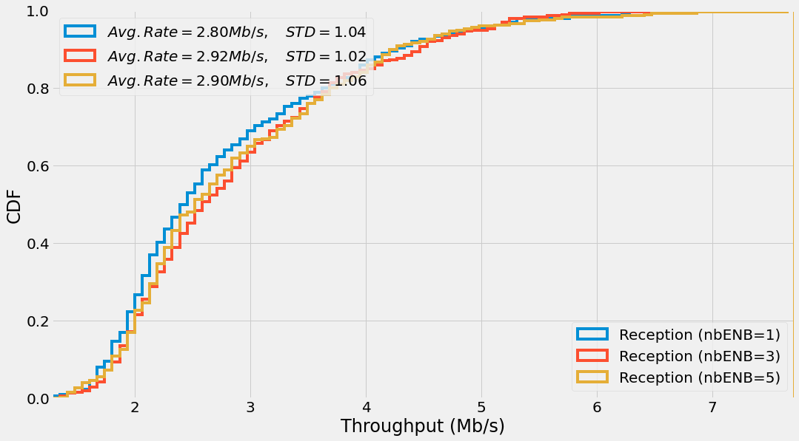
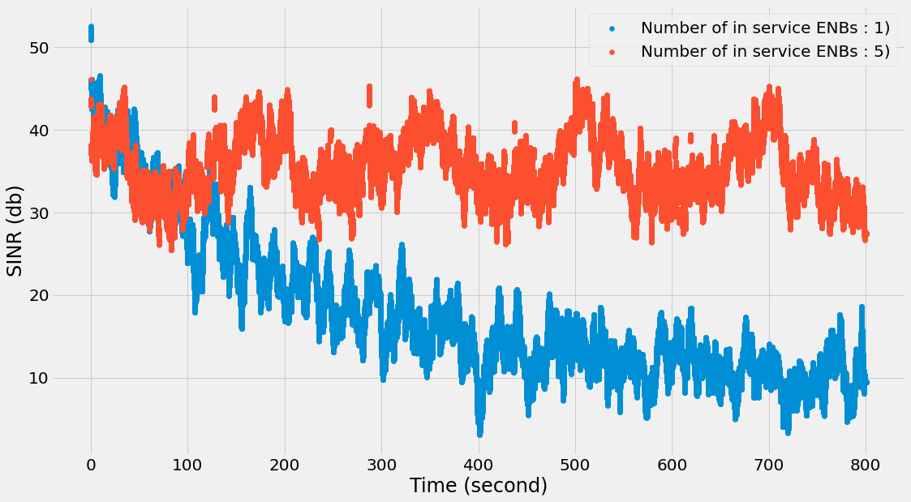
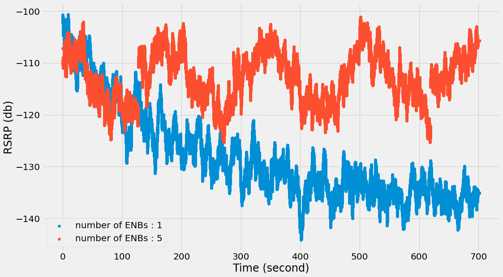

# UAV Network Simulation with NS-3 and Ardupilot  

## Overview  
This repository contains an **NS-3 module for UAV network simulation**, integrated with **Ardupilot**, a UAV flight simulator. The **Ardupilot module** simulates UAV trajectories, while **NS-3** simulates the wireless network between UAVs, enabling realistic network performance evaluation in UAV-based communication scenarios.  

## Features  
- **NS-3-based Wireless Network Simulation**: Models communication between UAVs over wireless links.  
- **Ardupilot Integration**: Simulates UAV trajectories and movement dynamics.  
- **Customizable UAV Networks**: Supports varying mobility patterns, network topologies, and wireless communication protocols.  
- **Flexible Scenario Configuration**: Users can modify UAV flight paths and network parameters for different research scenarios.  

## Prerequisites  
To use this simulator, you need:  
- **NS-3**
- **Ardupilot**
- **Python** (for scripting and automation)  
- **C++** (for NS-3 module development)  
- Any other dependencies required for Ardupilot and NS-3  

## Installation  
1. **Clone the repository**  
   ```sh
   git clone https://github.com/yourusername/uav-ns3-ardupilot.git
   cd uav-ns3-ardupilot
   ```  
2. **Set up NS-3**  
   Follow NS-3 installation guidelines and add this module to your NS-3 workspace.  

3. **Install Ardupilot**  
   Follow the official Ardupilot setup instructions and configure it to run alongside NS-3.  

4. **Compile and Run**  
   ```sh
   ./waf configure
   ./waf build
   ./waf --run "your_simulation_script"
   ```  

## Usage  
- Define UAV trajectories using **Ardupilot**.  
- Configure wireless network parameters in **NS-3**.  
- Run simulations and collect network performance metrics.  
- Analyze results to evaluate UAV communication efficiency.  

## Simulation Results  

### CDF of Network Throughput for UAVs  


### Average SINR for UAVs  
  

### Average RSRP  
  

## Example Scenarios  
- **Multi-UAV Communication**: Evaluates network performance in swarming UAVs.  
- **Relay-Based Communication**: Simulates UAVs acting as relay nodes.  
- **Interference and Link Quality Analysis**: Studies signal degradation in dynamic UAV networks.